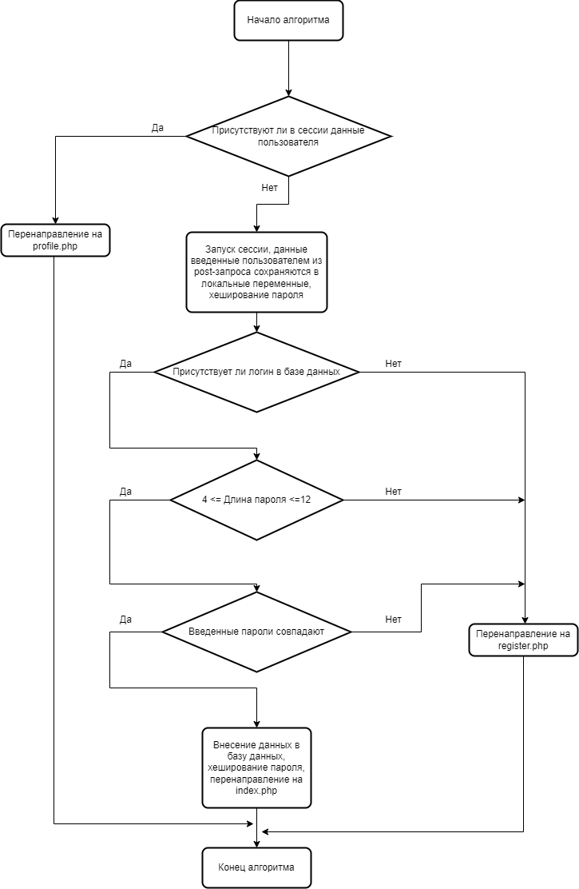

# Отчёт к лабораторной работе №1
## По курсу "Основы программирования"

[Ссылка на репозиторий на github]: https://github.com/scifipunk/lab1

## Текст задания
Цель работы - спроектировать и разработать систему авторизации пользователей на протоколе HTTP. 
Выполненные требования:
- функциональность входа/выхода, 
- хранение паролей в хешированном виде, 
- форма регистрации, 
- хранение хеша пароля с солью.
## Пользовательский интерфейс
Необходимо создать три страницы: входа, регистрации и главную страницу сайта.
1. Страница входа
<!--  -->
2. Страница регистрации
<!--  -->
3. Главная страница сайта
<!--  -->
Доступ к третьей странице невозможен не вошедшему на сайт пользователю.
## Пользовательские сценарии работы
1. Пользователь вводит в адресной строке register.php и попадает на форму регистрации. Вводит данные, но пользователь с таким логином уже существует - появляется сообщение "Такой логин уже есть". Пользователь перенаправляется обратно на register.php.
2. Пользователь вводит в адресной строке register.php и попадает на форму регистрации. Вводит данные, но пароль не подходит условиям (длина пароля должна быть от 4х до 12ти символов) - появляется сообщение "Пароль должен быть от 4 до 12 символов". Пользователь перенаправляется обратно на register.php.
3. Пользователь вводит в адресной строке register.php и попадает на форму регистрации. Вводит данные, но пароли не совпадают - появляется сообщение "Пароли не совпадают". Пользователь перенаправляется обратно на register.php.
4. Пользователь вводит в адресной строке register.php и попадает на форму регистрации. Вводит данные, но изображение не загружается - появляется сообщение "Ошибка при загрузке сообщения". Пользователь перенаправляется обратно на register.php.
5. Пользователь вводит в адресной строке index.php и попадает на форму входа. Вводит данные, но неверно - появляется сообщение "Не верный логин или пароль". Пользователь перенаправляется обратно на index.php.
6. Пользователь вводит в адресной строке index.php и попадает на форму входа. Вводит верные данные, попадает на страницу profile.php. После - выходит.
7. Пользователь вводит в адресной строке profile.php и оказывается перенаправлен на страницу со входом. Вводит свои верные данные и попадает profile.php.
8. Авторизованный пользователь вводит в адресной строке register.php или index.php - алгоритм перенаправляет его обратно на profile.php.
## Описание API сервера и  его хореографии
Сервер использует HTTP POST запросы с полями full_name (ФИО), login (логин), email(адрес жлектронной почты), password (пароль), avatar(аватарка). Также, сервер использует ceccию для хранения и передачи данных о пользователе и ошибках между страницами.
1. Алгоритм регистрации на сайте - отправляется запрос, который возвращает данные о пользователе с отправленным логином, если данные найдены, то в сессию записывается сообщение об ошибке, после чего пользователь перенаправляется на register.php, где на экране выведено сообщение "Такой логин уже есть".
2. Алгоритм регистрации на сайте проверяет введенный пароль. Если его длина меньше 4х или больше 12ти символов, то в сессию записывается сообщение об ошибке, после чего пользователь перенаправляется на register.php, где на экране выведено сообщение "Пароль должен быть от 4 до 12 символов".
3. Алгоритм регистрации на сайте сверяет введенные пароли. Если они не совпадают, то в сессию записывается сообщение об ошибке, после чего пользователь перенаправляется на register.php, где на экране выведено сообщение "Пароли не совпадают".
4. Алгоритм регистрации на сайте проверяет результат выполнения функции move_uploaded_file(). Если функцию выполнить по какой-то причине не удалось, то в сессию записывается сообщение об ошибке, после чего пользователь перенаправляется на register.php, где на экране выведено сообщение "Ошибка при загрузке сообщения".
5. Алгоритм аутентификации сверяет введеные пароль и логин с имеющимися в базе данных. Если пользователь с такими логином и паролем не был найден, то в сессию записывается сообщение об ошибке, после чего пользователь перенаправляется на index.php, где на экране выведено сообщение "Неверный логин или пароль".
6. Алгоритм аутентификации сверяет введеные пароль и логин с имеющимися в базе данных. Если пользователь с такими логином и паролем был найден, то массив с данными пользователя с помощью функции mysqli_fetch_assoc(). Из этого массива в сессию записываются поля 'id', 'full_name', 'avatar' и 'email'. После чего пользователя направляют на страницу profile.php. После того как пользователь выйдет, запускается функция деаутентификации пользователя, которая удаляет данные пользователя из сессии.
7. Если пользователь не вошел в свою учетную запись, но ввел в адресной строке profile.php, то алгоритм проверяет данные польщователя, хранящиеся в сессии, после чего перенаправляет его обратно на index.php.
8. Если пользователь не вышел из своей учетной записи, но ввел в адресной строке register.php или index.php, то алгоритм проверяет наличие данных пользователя в сессии и перенаправляет его обратно на profile.php.

## Описание структуры базы данных
Для администрирования сервера MySQL и просмотра содержимого базы данных используется браузерное приложение phpMyAdmin. Используется 5 столбцов:
1. "id" типа int с автоматическим приращением для выдачи уникальных id каждому зарегистрированному пользователю,
2. "Full_name" типа varchar для хранения ФИО пользователя,
3. "login" типа varchar для хранения логина этого пользователя, используется в качетсве соли для хеширования пароля,
4. "email"  типа varchar для хранения адреса электронной почты пользователя,
5. "password" типа varchar для хранения пароля пользователя в хешированном виде,
6. "avatar" типа varchar для хранения аватарки пользователя.

Пример того, как данные пользователей выглядят в базе данных.

## Описание алгоритмов
1. Алгоритм входа на сайт

2. Алгоритм регистрации на сайте

## Примеры HTTP запросов/ответов
<!-- 

 -->
## Значимые фрагменты кода
1. Алгоритм регистрации на сайте
```
<?php
    session_start();
    require_once 'connect.php';
    $full_name = $_POST['full_name'];
    $login = $_POST['login'];
    $email = $_POST['email'];
    $password = $_POST['password'];
    $password_confirm = $_POST['password_confirm'];
    $check_user = mysqli_query($connect, "SELECT * FROM `users` WHERE `login` = '$login')
    if ( $check_user > 0 ) {
        $_SESSION['message'] = 'Такой логин уже есть';
        header('Location: ../register.php');
    }
    if ( strlen($password) < 4 && strlen($password) > 12 ) {
        $_SESSION['message'] = 'Пароль должен быть от 4 до 12 символов';
        header('Location: ../register.php');
    }
    if ($password === $password_confirm) {
        $path = 'uploads/' . time() . $_FILES['avatar']['name'];
        if (!move_uploaded_file($_FILES['avatar']['tmp_name'], '../' . $path)) {
            $_SESSION['message'] = 'Ошибка при загрузке сообщения';
            header('Location: ../register.php');
        }
        $password = md5($password . $login);
        mysqli_query($connect, "INSERT INTO `users` (`id`, `full_name`, `login`, `email`, `password`, `avatar`) VALUES (NULL, '$full_name', '$login', '$email', '$password', '$path')");
        $_SESSION['message'] = 'Регистрация прошла успешно!';
        header('Location: ../index.php');
    } else {
        $_SESSION['message'] = 'Пароли не совпадают';
        header('Location: ../register.php');
    }
?>
```
2. Алгоритм входа на сайт
```
<?php
    session_start();
    require_once 'connect.php';
    $login = $_POST['login'];
    $password = md5($_POST['password'] . $_POST['login']);
    $check_user = mysqli_query($connect, "SELECT * FROM `users` WHERE `login` = '$login' AND `password` = '$password'");
    if (mysqli_num_rows($check_user) > 0) {
        $user = mysqli_fetch_assoc($check_user);
        $_SESSION['user'] = [
            "id" => $user['id'],
            "full_name" => $user['full_name'],
            "avatar" => $user['avatar'],
            "email" => $user['email']
        ];
        header('Location: ../profile.php');
    } else {
        $_SESSION['message'] = 'Не верный логин или пароль';
        header('Location: ../index.php');
    }
?>
```
3. Функция аунтентификации пользователя
```
function checkAuth(): bool 
{
    require("connection.php");
    $user_token = $_COOKIE['auth_token'];
    
    $query = "SELECT * FROM users WHERE auth_token='$user_token' limit 1";
    $result = mysqli_query($con, $query);
    $user_data = mysqli_fetch_assoc($result);
    
    if ($_COOKIE['auth_token'] != $user_data['auth_token']) {
        return false;
    }
    else {
        return true;
    }
}
```
